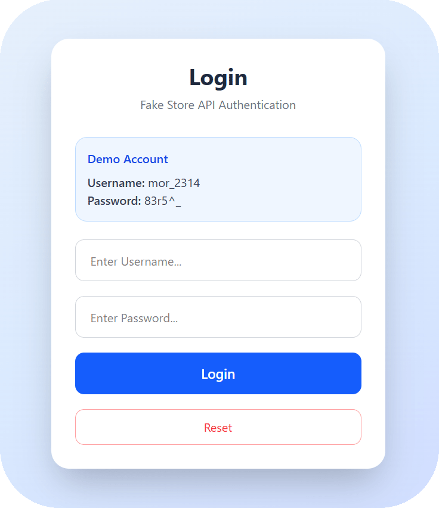
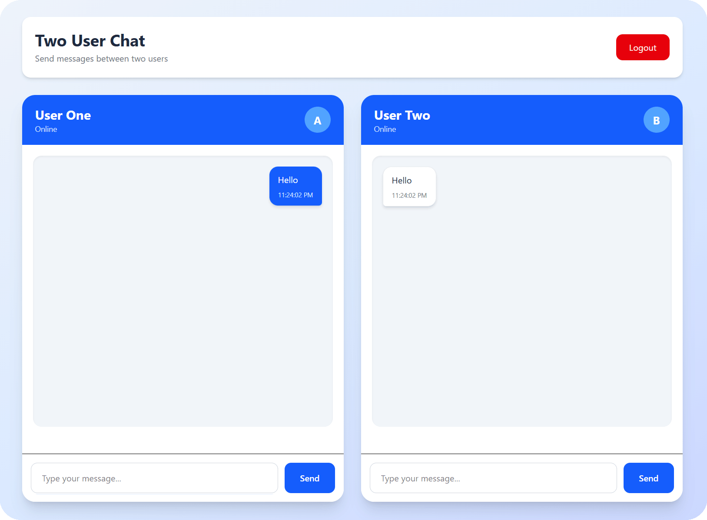

# 💬 React Chat App

A simple two-user chat application built with React to practice React fundamentals, state management, component communication, props, and conditional rendering.

---

## 📸 Screenshots

### 🔐 Login

<p align="center">
  
</p>

### 💬 Two User Chat

<p align="center">
  
</p>

---

## ✨ Features

- 🔐 Login authentication using Fake Store API
- 👤 Two separate chat users
- 💬 Send messages between two users
- 📨 Sent and received messages have different styles
- 🕐 Message creation time
- 🔄 Real-time UI updates using React state
- 🚪 Logout functionality
- 💾 Token storage using Local Storage
- 📱 Responsive layout

---

## 🛠️ Technologies

- React
- JavaScript (ES6+)
- Tailwind CSS
- Vite
- Fetch API
- Local Storage

---

## 🧠 React Concepts Practiced

This project was created as a React learning exercise and includes:

- `useState`
- Props
- Component communication
- Parent-to-child data passing
- Passing functions through props
- Conditional rendering
- Rendering lists with `.map()`
- Controlled inputs
- Event handling
- Local Storage
- Fetch API
- Async/Await
- Basic component structure

---

## 🧩 Project Structure

```text
src/
├── Components/
│   ├── Body.jsx
│   ├── Chat.jsx
│   ├── Chatbox.jsx
│   ├── Login.jsx
│   └── Message.jsx
│
├── App.jsx
├── App.css
├── index.css
└── main.jsx
```

### Components

**Login.jsx**

Handles user login and authentication using the Fake Store API.

**Chat.jsx**

Acts as the main container for the two chat boxes and manages logout functionality.

**Chatbox.jsx**

Contains the input field, send button, and messages for each user.

**Body.jsx**

Displays the messages belonging to each user.

**Message.jsx**

Controls the appearance and layout of individual messages depending on whether they were sent or received.

---

## 🔑 Test Account

This project uses the Fake Store API for testing authentication.

You can use the following test account:

```text
Username: mor_2314
Password: 83r5^_
```

---

## 🚀 Getting Started

Clone the repository:

```bash
git clone https://github.com/ReNxOO/react-chat-app.git
```

Go to the project directory:

```bash
cd react-chat-app
```

Install dependencies:

```bash
npm install
```

Run the development server:

```bash
npm run dev
```

Then open the local development URL provided by Vite.

---

## 🔐 Authentication

The login system sends the username and password to the Fake Store API.

After a successful login, the returned token is stored in `localStorage`:

```js
localStorage.setItem("token", data.token);
```

The application uses this token to determine whether the user is logged in.

---

## 💬 How It Works

After logging in, two chat boxes are displayed:

```text
┌─────────────────────┐     ┌─────────────────────┐
│      userOne        │     │      userTwo        │
│                     │     │                     │
│     Messages        │     │     Messages        │
│                     │     │                     │
│ [ Enter Message ]   │     │ [ Enter Message ]   │
│              Send   │     │              Send   │
└─────────────────────┘     └─────────────────────┘
```

When a user sends a message, the message is added to the corresponding state and displayed in the appropriate chat box.

---

## 📚 Purpose

This project was built as a learning exercise while studying React.

The main goal was to understand how components communicate with each other and how React state can be used to manage and display data.

---

## 👨‍💻 Author

**Reza Arab**

GitHub:  
https://github.com/ReNxOO